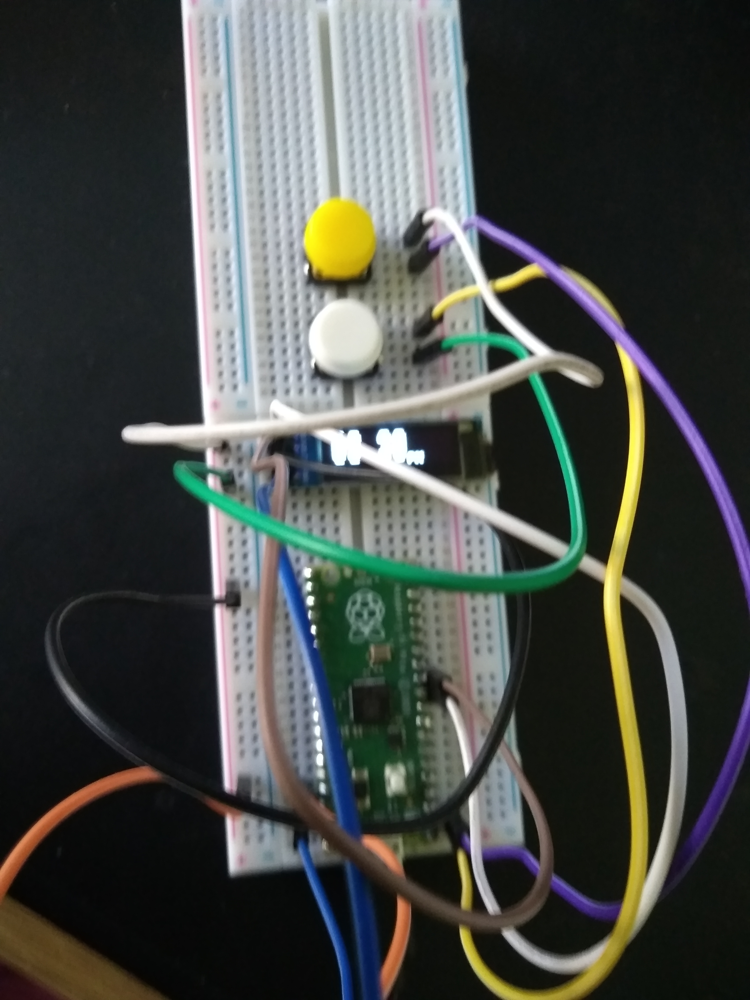

# Raspberry-Pico-SD1306-Clock
 Clock running on a Raspberry Pico using an SD1306 as a display. Developed under MicroPython but should be easy to convert to CircuitPython.

 ## Pin connections
 - GP0 - Menu switch, other side of switch to PIN 36 (3v3 out) on Pico
 - GP1 - Select switch, other side of switch to PIN 36 (3v3 out) on Pico
 - GP8 - SCA om SD1306
 - GP9 - SCK on SD1306
 - GP15 - Piezo Buzzer, other side of buzzer to any ground on Pico
 - VCC on SD1306 - PIN 36 (3V3 out) on Pico
 - GND on SD1306 - Any ground on Pico
